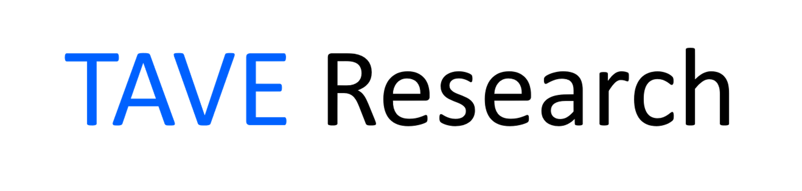

# 테이브 알고리즘 스터디
- 기간: 2021.03 - Now
- 시간: 매주 목요일 20:30

## 참여인원

- [박제윤](http://jeiyoon.github.io/), [이상원](https://nowgnas.github.io/), [허주희](https://heojuhuigitblog.netlify.app/), [이하연](https://harlie-98.tistory.com/), [임예람](https://itwithruilan.tistory.com/)

## 공부자료

- 교재 1: [파이썬 알고리즘 인터뷰](https://github.com/onlybooks/algorithm-interview)
- 교재 2: [이것이 취업을 위한 코딩 테스트다 with Python](https://github.com/ndb796/python-for-coding-test)
- 프로그래머스: https://programmers.co.kr/learn/challenges
- 코딜리티: https://app.codility.com/programmers/

## 스케쥴

- https://tall-hardware-692.notion.site/Python-Algorithm-Study-TAVE-ec9a8e62734d4297bdfc54bdf84768bf

## 목차 (교재2: 이것이 취업을 위한 코딩 테스트다 with Python)

- 

## 목차 (교재 1: 파이썬 알고리즘 인터뷰)

- 1장   코딩인터뷰 (p39 - p52 / 14 pages) [✔] [✔]
- 2장   프로그래밍 언어선택 (p53 - p72 / 20 pages) [✔] [✔]
- 3장   파이썬 (p73 - p98 / 26 pages) [✔] [✔]
- 4장   빅오, 자료형 (p99 - p120 / 22 pages) [✔] [✔]
- 5장   리스트, 딕셔너리 (p121 - p135 / 15 pages) [✔] [✔]
- 6장   문자열 조작 (p137 - p165 / 29 pages) [✔] [✔]
- 7장   배열 (p169 - p198 / 30 pages) [✔] [✔]
- 8장   연결리스트 (p199 - p240 / 42 pages) [✔] [✔]
- 9장   스택, 큐 (p241 - p263 / 24 pages) [✔] [✔]
- 10장   데크, 우선순위 큐 (p265 - p278 / 14 pages) [✔] [✔]
- 11장   헤시 테이블 (p279 - p313 / 35 pages) [✔] [✔]
- 12장   그래프 (p317 - p370 / 54 pages) [✔] [✔]
- 13장   최단 경로 문제 (p371 - p382 / 12 pages) [✔] [✔]
- 14장   트리 (p383 - p 445/ 63 pages) [✔] [✔]
- 15장   힙 [✔]
- 16장   트라이 [✔]
- 17장   정렬 (p479 - p513 / 35 pages) [✔]
- 18장   이진 검색 (p515 - p539 / 25 pages) [✔]
- 19장   비트 조작 (p541 - p568 / 28 pages) [✔]
- 20장   슬라이딩 윈도우 (p569 - p583 / 15 pages) [✔]
- 21장   그리디 알고리즘 (p585 - p606 / 22 pages) [✔]
- 22장   분할 정복 (p607 - p620 / 14 pages) [✔]
- 23장   다이나믹 프로그래밍 (p621 - p646 / 26 pages) [✔]
- 부록 A   회사 및 이직 가이드 (p647 - p680 / 34 pages) [✔]
- 부록 B   카카오 공채 문제 풀이 (p681 - p708/ 28 pages) [✔]

<!--  -->
<!--  -->
 
